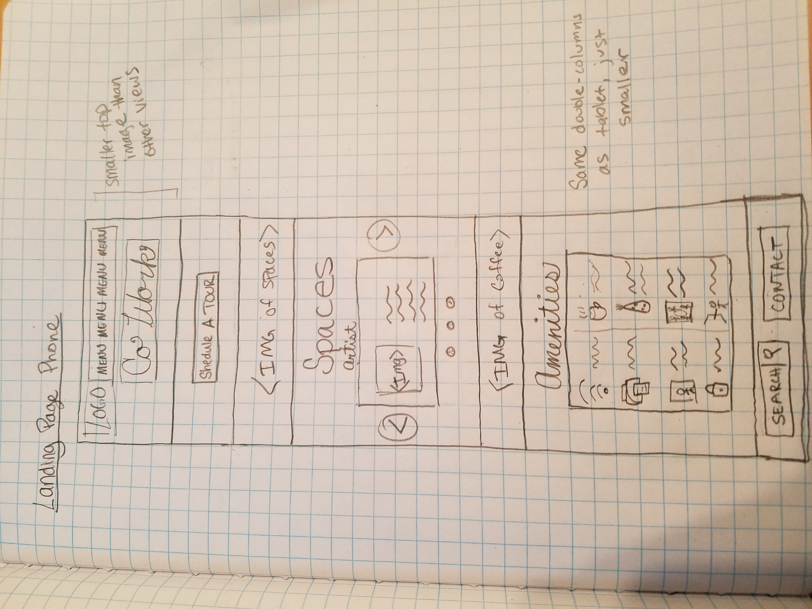

## Co-working Space Design

---
### Description
The space (company title Co-Work) is a vibrant and funky co-working space that has been newly remodeled. The general feel is high-end but welcoming, safe, and comfortable for a range of professionals. The space has multiple amenities including high-speed internet, communal and private offices, printing and faxing services, a coffee counter, and fun Thursday afternoon activities.

The goal of this project is to create a web interface that embodies these ideals of Co-Work. The site must be easy to use and navigate for a diverse user group, and must show the personality of Co-Work. Careful thought was given to fonts and coloring in particular. The design was occasionally evaluated for simplicity. If an area was too busy, elements were removed to keep the design clean.

---

### Target Users:

##### Worker Types:
- Tech Workers
- Craftspeople / Artists
- Counselors / People with clients
- Daytraders / Traditional business people

##### Site managers and administration
---

### User Stories
##### Tech Workers:
*Goals of use:* Identify Co-Work as a comfortable, QUIET space to work. Identify amenities. Ability to easily book a conference room and see availability. Identifying Thursday activities in advance.

*Motivation:* Compare Co-Work with other co-working spaces, especially amenities.

*Pain Points:* No ease of seeing conference room availability, unreadable interface that sometimes selects wrong time (real we-work example). Coffee running out. App not sleek enough to catch developer's attention (or having bugs). Co-working in communal spaces can be riddled with distractions, especially noise.

*Technical ability:* Proficient to Expert

*Common Devices:* Computer likely, since they will have their computers with them and open most of the time.

##### Daytraders and Business people:
*Goals of use:* Identify Co-Work as a comfortable, professional space to work in a good area for business. Identify amenities. Ability to easily book a private room for meeting with clients, or conference room for presentations.

*Motivation:* Book rooms when needed. Compare Co-Work with other co-working spaces, especially amenities.

*Pain Points:* No ease of seeing conference room availability. Information not displayed clearly. Co-working in communal spaces can be riddled with distractions, especially noise.

*Technical ability:* Beginner to Expert

*Common Devices:* Computer or smartphone likely. Most have computers but check email on phone on the go.

##### Counselors and others with clients:
*Goals of use:* Identify Co-Work as a comfortable, professional space to work in that will be comfortable for clients. Identify amenities. Ability to know they have a private room available when needed. *Possibly ability for clients to book with them through Co-Work interface, or leave feedback.*

*Motivation:* Book rooms when needed (frequently). Insure Co-Work is safe and welcoming for clientele. Compare Co-Work with other co-working spaces. Extra amenities less important than client impressions.

*Pain Points:* Overbooked private rooms. Interface not welcoming to clients/temporary user of space.

*Technical ability:* Beginner to Proficient

*Common Devices:* Computer or smartphone likely. Most have computers but check email on phone on the go.

##### Artists and Craftspeople:
*Goals of use:* Identify Co-Work as a comfortable, fun, motivating space. Know that Co-Work has areas to sit/chat/drink coffee. Identify amenities. Identify a place within Co-Work to store supplies, possibly with ability to reserve this space through interface.

*Motivation:* Find a co-working space that is FOR THEM, not just about tech workers. Reserve storage space for supplies.

*Pain Points:* Inability to know if they will have storage space available. Not knowing who you'll be working near (other artists who want to chat? Techies who want a quiet space?)

*Technical ability:* Beginner to Proficient

*Common Devices:* Smartphone most likely, not all with have computers with them. Easier to check a phone when working on a craft (saves bench space).

##### Site managers and administrators:
*Goals of use:* Ability to make changes to the site. Easily post/edit Thursday afternoon activities. Edit availability of private spaces. See metrics (e.g. How many artists? How often is conference room A used?)

*Motivation:* Showcase features of their co-working space and their personality. Allow their clients (i.e. workers) easy access to rooms/storage/etc.. Showcase upcoming fun activities (requires frequent editing).

*Pain Points:* Editing of Thursday activities unintuitive. Metrics not clear.

*Technical ability:* Beginner to Proficient, best to assume beginner when designing for this group

*Common Devices:* Smartphone likely, especially for checking metrics on-the-go. Computer more likely for updating site.

---

## Brainstorm

Site needs to look sophisticated but accessible. Hipster, in cursive. Classy, in fun colors. Site should elicit the smell of coffee.

http://www.theurbanhive.com/ is a *very good* example of this aesthetic. Full-sized image banner of space makes it look large and comfortable. Muted colors in image with white text = luxury. The fonts have been picked carefully. A concluding banner's text "YOU BELONG HERE" is welcoming.

https://www.greenspaces.com/ is a *good* example of using lots of white space. One banner, followed by a "as recommended in" list, followed by pictures and blurbs from the CEOs. Their pictures and burbs make them seem friendly and easily accessible. 3D tour shows full facility. I like this one because they don't seem like the have anything to hide; very un-corporate.

https://cohoots.com/ is a *bad* example of the look Co-Work should have. It's got too many bright colors in hard-edge boxes that the space comes off as corporate and busy. Uninviting. One thing that does work is the use of fun icons and keywords ("boost productivity") for amenities.

Pulling from these and other examples for inspiration, I believe Co-Work's site should use a color scheme of grey + one main color + one complementary color maximum, and white should be prevalent. Font need to be carefully chosen. One sans-serif font for the body text for a clean, hip look and one fancier text for headings for luxury/sophistication.

Images provided should be large, maybe somewhat transparent with lettering on top. Most images contain plants, these should show on sides of page to give the idea that at Co-Work, you'll be in a natural environment.

Button to sign up/inquire about pricing shouldn't be too in your face. Community emphasized. Amenity icons clean and clear.

Interface for reserving rooms (if this is included) clear, and easy to use.

---

## Sketches

### Landing Page Desktop

### Landing Page Tablet

### Landing Page Mobile

### Contact Page Mobile

### Amenities Page Mobile

### Membership Page Mobile

---

## Wireframes

### Landing Page Desktop

---

## Technologies used
- Sketch version 49.3 for wireframing
- icons8.com for icons
- google fonts
- Pencil and paper

---

## Set-up Instructions

1. If you don't have Sketch installed, download from sketch.com *NOTE: Sketch requires iOS to run. If you don't have iOS, refer to screneshots*
2. Clone the github repository containing the project. Once downloaded, you can open the Sketch file in sketch.
3. To see all fonts in this sketch project, download the Comfortaa font from Google Fonts. Only the regular and bold are used in this project, so you won't need to buy anything.

---

## Responsiveness
This project is designed for desktop, tablet, and mobile view ports. Mobile views occasionally include carousels to display information in a smaller format.

---

## Development Roadmap

As of 2/22/18, the wireframing is done only for the desktop view of the landing page. The finished site will include:
- landing page (done for desktop)
- contact page
- amenities page
- Membership page

Ideas for future pages include but are not limited to:
- Book a conference room page
- Tour scheduling page
- Events calendar
- Reviews / testimonials page

---
## Licensing

Copyright 2019 Kimberly McConnell

Permission is hereby granted, free of charge, to any person obtaining a copy of this software and associated documentation files (the "Software"), to deal in the Software without restriction, including without limitation the rights to use, copy, modify, merge, publish, distribute, sublicense, and/or sell copies of the Software, and to permit persons to whom the Software is furnished to do so, subject to the following conditions:

The above copyright notice and this permission notice shall be included in all copies or substantial portions of the Software.

THE SOFTWARE IS PROVIDED "AS IS", WITHOUT WARRANTY OF ANY KIND, EXPRESS OR IMPLIED, INCLUDING BUT NOT LIMITED TO THE WARRANTIES OF MERCHANTABILITY, FITNESS FOR A PARTICULAR PURPOSE AND NONINFRINGEMENT. IN NO EVENT SHALL THE AUTHORS OR COPYRIGHT HOLDERS BE LIABLE FOR ANY CLAIM, DAMAGES OR OTHER LIABILITY, WHETHER IN AN ACTION OF CONTRACT, TORT OR OTHERWISE, ARISING FROM, OUT OF OR IN CONNECTION WITH THE SOFTWARE OR THE USE OR OTHER DEALINGS IN THE SOFTWARE.
